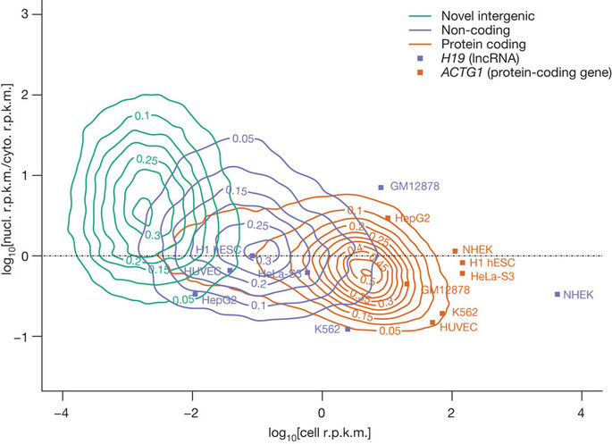
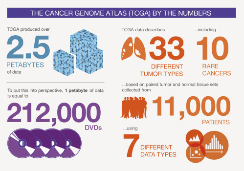

# Appendix II. Public Data

## Major Consortium Data

### 1. ENCODE \(cell lines\)

> a comprehensive list of functional elements in the human genome.
>
> [https://www.encodeproject.org/](https://www.encodeproject.org/)

[Cell types of ENCODE](https://www.genome.gov/26524238/encode-project-common-cell-types/)

**Tier 1:**

* **GM12878** is a lymphoblastoid cell line produced from the blood of a female donor with northern and western European ancestry by EBV transformation. It was one of the original HapMap cell lines and has been selected by the International HapMap Project for deep sequencing using the Solexa/Illumina platform. **This cell line has a relatively normal karyotype** and grows well. Choice of this cell line offers potential synergy with the International HapMap Project and genetic variation studies. It represents the mesoderm cell lineage. Cells will be obtained from the [Coriell Institute for Medical Research](http://www.coriell.org/) \[coriell.org\] \(Catalog ID GM12878\).
* **K562** is an immortalized cell line produced from a female patient with chronic myelogenous leukemia \(CML\). It is a widely used model for cell biology, biochemistry, and erythropoiesis. It grows well, is transfectable, and represents the mesoderm linage. Cells will be obtained from the [America Type Culture Collection \(ATCC\)](http://www.atcc.org/) \[atcc.org\] \(ATCC Number CCL-243\).
* **H1** **human embryonic** stem cells will be obtained from [Cellular Dynamics International](http://www.cellulardynamics.com/) \[cellulardynamics.com\].

**Tier 2:**

* **HeLa-S3**
* **HepG2** 
* **HUVEC**

**Tier 2.5**

* SK-N-SH
* IMR90 \(ATCC CCL-186\)
* A549 \(ATCC CCL-185\)
* MCF7 \(ATCC HTB-22\)
* HMEC or LHCM
* CD14+
* CD20+
* Primary heart or liver cells
* Differentiated H1 cells

**Figure 1.** Cellular Localization of different types of RNAs, Ref.: [https://www.nature.com/articles/nature11233](https://github.com/lulab/training_book/tree/ffd6275b84e726ce17256552a0d44151ed230192/h%20ttps:/www.nature.com/articles/nature11233/README.md)

### 2. CCLE \(cancer cell lines\)

### 3. TCGA \(tissue\)

> **The Pan-Cancer Atlas**
>
> From the analysis of over 11,000 tumors from 33 of the most prevalent forms of cancer, the Pan-Cancer Atlas provides a uniquely comprehensive, in-depth, and interconnected understanding of how, where, and why tumors arise in humans. As a singular and unified point of reference, the Pan-Cancer Atlas is an essential resource for the development of new treatments in the pursuit of precision medicine.
>
> [https://portal.gdc.cancer.gov/](https://portal.gdc.cancer.gov/)
>
> [http://www.cell.com/pb-assets/consortium/pancanceratlas/pancani3/index.html](http://www.cell.com/pb-assets/consortium/pancanceratlas/pancani3/index.html)

### 4. 1000 Genomes

> find most genetic variants with frequencies of at least 1% in the populations studied.
>
> [http://www.internationalgenome.org/](http://www.internationalgenome.org/)

## Online **Databases**  

### Major Data Central

**1. UCSC**

**genome browser** for vertebrate. [https://genome.ucsc.edu/](https://genome.ucsc.edu/)

**2. Ensemble**

**genome annotation**. [http://www.ensembl.org/index.html](http://www.ensembl.org/index.html)

**3. NCBI**

contribute to the NIH mission of ‘uncovering new knowledge’. [https://www.ncbi.nlm.nih.gov/](https://www.ncbi.nlm.nih.gov/)

### Expression Data  

**4. GTEx**

gene expression in **different tissues**. [https://www.gtexportal.org/home/](https://www.gtexportal.org/home/)

**5. Expression Atlas**

exploring gene expression results across species under **different biological conditions**. [https://www.ebi.ac.uk/gxa/home](https://www.ebi.ac.uk/gxa/home)

**6. BioPortal**

visualization, analysis and download of large-scale **cancer genomics data** sets. [http://www.cbioportal.org/index.do](http://www.cbioportal.org/index.do)

**7. TCGA GEPIA**

gene expression in different TCGA tumor types. [http://gepia.cancer-pku.cn/index.html](http://gepia.cancer-pku.cn/index.html)

**8. TCGA ncRNA**

[http://ibl.mdanderson.org/tanric/\_design/basic/index.html](http://ibl.mdanderson.org/tanric/_design/basic/index.html)

## Video

### a\) Imputation and confounders

[@Youtube](https://youtu.be/wdKIIAaLPyY)

[@Bilibili](https://player.bilibili.com/player.html?aid=30592697&cid=53397088&page=1)

