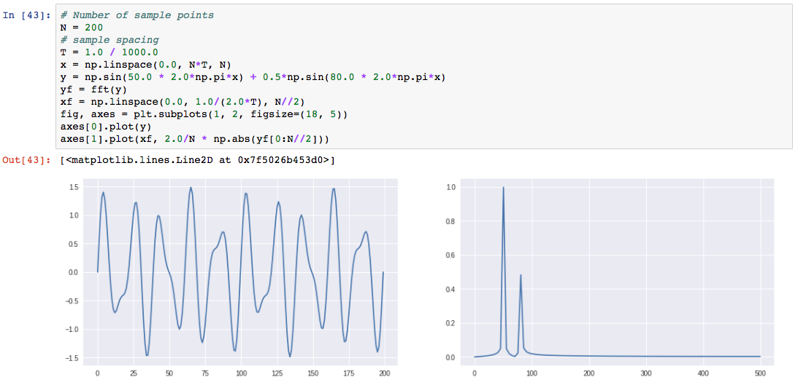
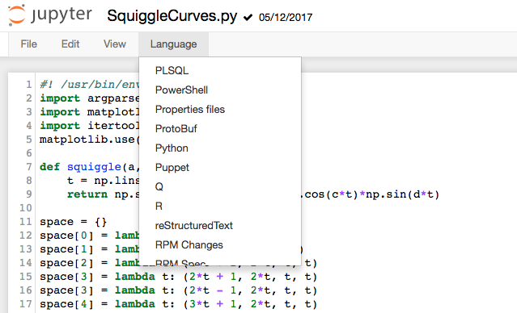
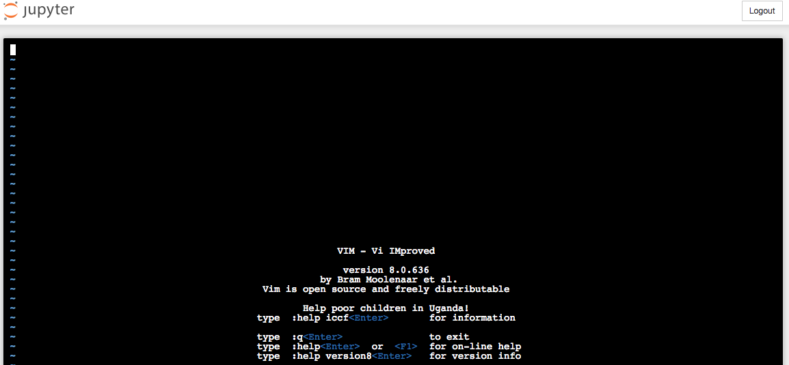
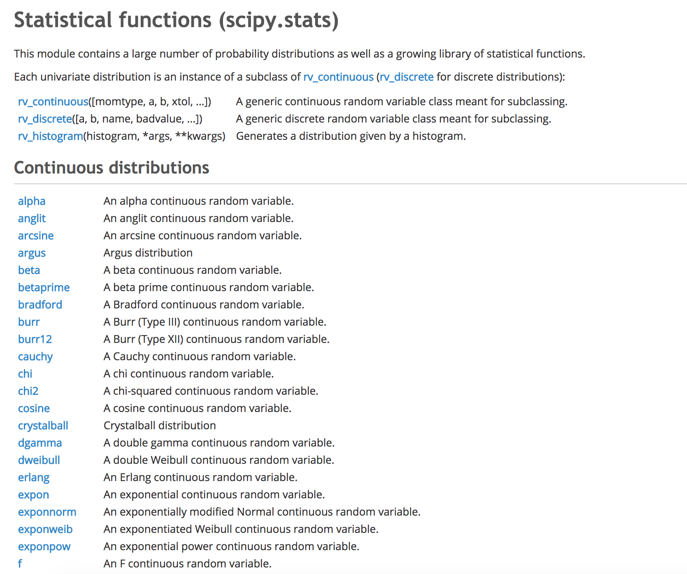
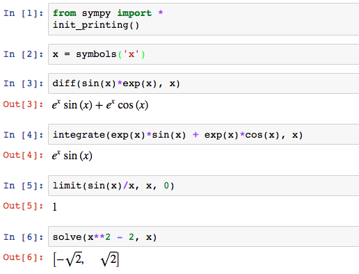
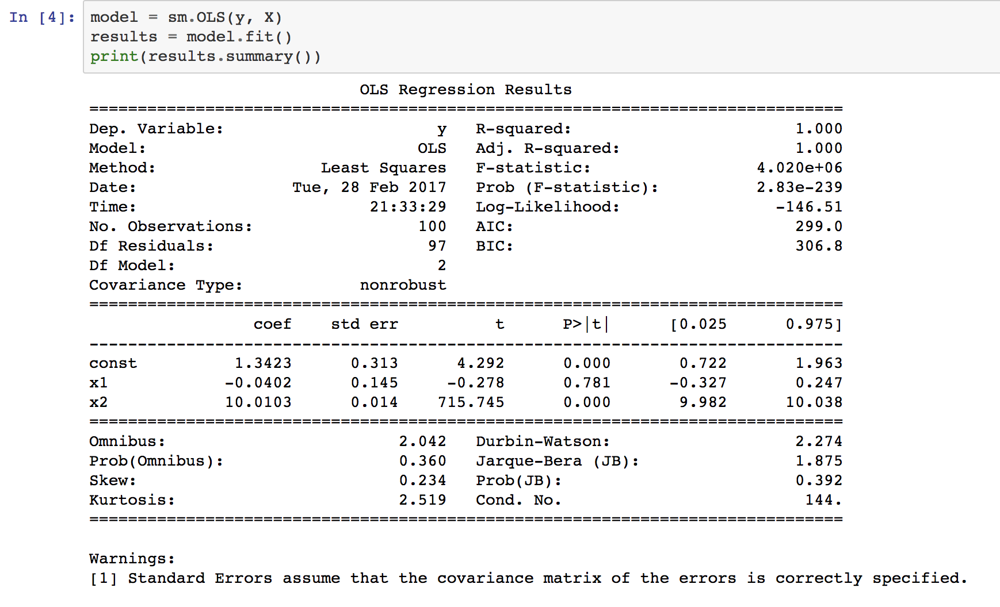
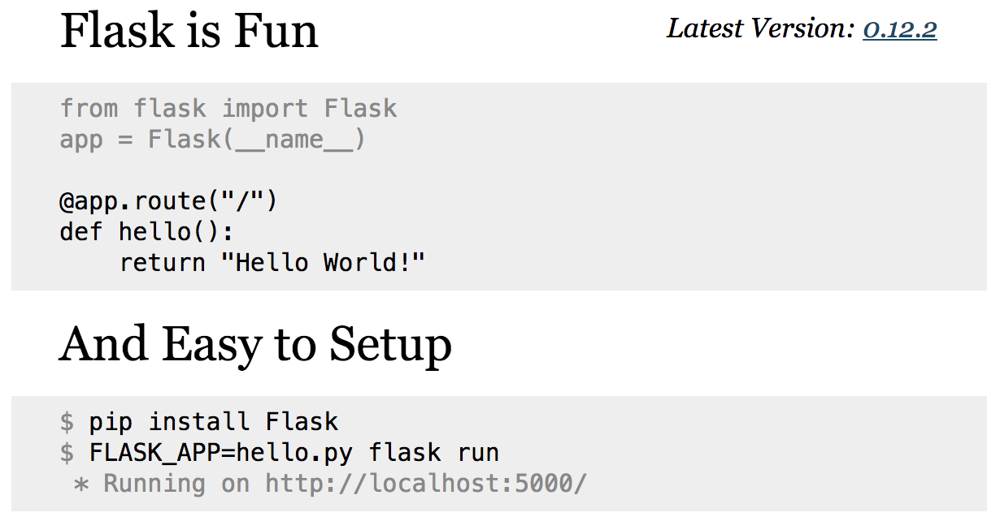

# 5.Python

## Python Tutorial <a id="python_tutorial"></a>


## Install Anaconda Python <a id="install_python"></a>

URL: \([https://www.anaconda.com/download/](https://www.anaconda.com/download/)\)

* Easy install of data science packages \(binary distribution\)
* Package management with `conda`


Install Python packages using conda:

```bash
conda install h5py
```

Update a package to the latest version:

```bash
conda update h5py
```

Install Python packages using pip:

```bash
pip install h5py
```

Update a package using pip:

```bash
pip install --upgrade h5py
```

## Python language tips <a id="tips"></a>

### Compatibility between Python 3.x and Python 2.x

**Biggest difference**: print is a function rather than statement in Python 3

This does not work in Python 3

```python
print 1, 2, 3
```

**Solution**: use the `__future__` module

```python
from __future__ import print_function
# this works both in Python 2 and Python 3
print(1, 2, 3)
```

**Second biggest difference**: some package/function names in the standard library are changed

**Python 2** =&gt; **Python 3**

```text
cStringIO => io.StringIO
Queue => queue
cPickle => pickle
ConfigParser => configparser
HTMLParser => html.parser
SocketServer => socketserver
SimpleHTTPServer => http.server
```

**Solution**: use the `six` module

* Refer to \([https://docs.python.org/3/library/\_\_future\_\_.html](https://docs.python.org/3/library/__future__.html)\) for usage of the `__future__` module.
* Refer to \([https://pythonhosted.org/six/](https://pythonhosted.org/six/)\) for usage of the `six` module.

### Get away from IndentationError

Python forces usage of tabs/spaces to indent code

```python
# use a tab
for i in range(3):
    print(i)
# use 2 spaces
for i in range(3):
  print(i)
# use 4 spaces
for i in range(3):
    print(i)
```

**Best practice**: always use 4 spaces. You can set whether to use spaces\(soft tabs\) or tabs for indentation.

In vim editor, use `:set list` to inspect incorrect number of spaces/tabs.

### Add Shebang and encoding at the beginning of executable scripts

Create a file named `welcome.py`

```python
#! /usr/bin/env python
# -*- coding: UTF-8 -*-
print('welcome to python!')
```

Then set the python script as executable:

```bash
chmod +x welcome.py
```

Now you can run the script without specifying the Python interpreter:

```bash
./welcome.py
```

### All variables, functions, classes are dynamic objects

```python
class MyClass():
    def __init__(self, name):
        self.name = name
# assign an integer to a
a = 1
print(type(a))
# assign a string to a
a = 'abc'
print(type(a))
# assign a function to a
a = range
print(type(a))
print(a(10))
# assign a class to a
a = MyClass
print(type(a))
b = a('myclass')
print(b.name)
# assign an instance of a class to a
a = MyClass('myclass')
print(b.name)
# get type of a
print(type(a))
```

### All python variables are pointers/references

```python
a = [1, 2, 3]
print('a = ', a)
# this add another refrence to the list
b = a
print('b = ', b)
# this will change contents of both a and b
b[2] = 4
print('a = ', a)
print('b = ', b)
```

### Use `deepcopy` if you really want to COPY a variable

```python
from copy import deepcopy
a = {'A': [1], 'B': [2], 'C': [3]}
print(a)
# shallow copy
b = dict(a)
# modify elements of b will change contents of a
b['A'].append(2)
print('a = ', a)
print('b = ', b)
# this also does not work
c = {k:v for k, v in a}
c['A'].append(3)
print('a = ', a)
print('c = ', c)
# recurrently copy every object of a
d = deepcopy(a)
# modify elements of c will not change contents of a
d['A'].append(2)
print('a = ', a)
print('d = ', d)
```

### What if I accidentally overwrite my builtin functions?

You can refer to \([https://docs.python.org/2/library/functions.html](https://docs.python.org/2/library/functions.html)\) for builtin functions in the standard library.

```python
A = [1, 2, 3, 4]
# Ops! the builtin function sum is overwritten by a number
sum = sum(A)
# this will raise an error because sum is not a function now
print(sum(A))
# recover the builtin function into the current environment
from __builtin__ import sum
# this works because sum is a function
print(sum(A))
```

**Note**: in Python 3, you should import from `builtins` rather than `__builtin__`

```python
from builtins import sum
```

### `int` is of arbitrary precision in Python!

In Pyhton:

```python
print(2**10000)
```

In R:

```r
print(2^10000)
```

### Easiest way to swap values of two variables

In C/C++:

```c
int a = 1, b = 2, t;
t = a;
a = b;
b = t;
```

In Python:

```python
a = 1
b = 2
b, a = a, b
print(a, b)
```

### List comprehension

Use for-loops:

```python
a = []
for i in range(10):
    a.append(i + 10)
print(a)
```

Use list comprehension

```python
a = [i + 10 for i in range(10)]
print(a)
```

### Dict comprehension

Use for-loops:

```python
a = {}
for i in range(10):
    a[i] = chr(ord('A') + i) 
print(a)
```

Use dict comprehension:

```python
a = {i:chr(ord('A') + i) for i in range(10)}
print(a)
```

### For the one-liners

Use ';' instead of '\n':

```bash
# print the first column of each line
python -c 'import sys; print("\n".join(line.split("\t")[0] for line in sys.stdin))'
```

For more examples of one-liners, please refer to \([https://wiki.python.org/moin/Powerful Python One-Liners](https://wiki.python.org/moin/Powerful%20Python%20One-Liners)\).

### Read from standard input

```python
import sys
# read line by line
for line in sys.stdin:
    print(line)
```

### Order of dict keys are NOT as you expected

```python
a = {'A': 1, 'B': 2, 'C': 3, 'D': 4, 'E': 5, 'F': 6}
# not in lexicographical order
print([key for key in a])
# now in lexicographical order
print([key for key in sorted(a)])
```

### Use enumerate\(\) to add a number during iteration

```python
A = ['a', 'b', 'c', 'd']
for i, a in enumerate(A):
    print(i, a)
```

### Reverse a list

```python
# a = [0, 1, 2, 3, 4, 5, 6, 7, 8, 9]
a = range(10)
print(a)
print(a[::-1])
```

### Strings are immutable in Python

```python
a = 'ABCDF'
# will raise an Error
a[4] = 'E'
# convert str to bytearray
b = bytearray(a)
# bytearray are mutable
b[4] = 'E'
# convert bytearray to str
print(str(b))
```

### tuples are hashable while lists are not hashable

```python
# create dict using tuples as keys
d = {
    ('chr1', 1000, 2000): 'featureA',
    ('chr1', 2000, 3000): 'featureB',
    ('chr1', 3000, 4000): 'featureC',
    ('chr1', 4000, 5000): 'featureD',
    ('chr1', 5000, 6000): 'featureE',
    ('chr1', 6000, 7000): 'featureF'
}
# query the dict using tuples
print(d[('chr1', 3000, 4000)])
print(d[('chr1', 6000, 7000)])
# will raise an error
d = {['chr1', 1000, 2000]: 'featureA'}
```

### Use itertools

Nested loops in a more concise way:

```python
A = [1, 2, 3]
B = ['a', 'b', 'c']
C = ['i', 'j', 'k']
D = ['x', 'y', 'z']
# Use nested for-loops
for a in A:
    for b in B:
        for c in C:
            for d in D:
                print(a, b, c, d)
# Use itertools.product
import itertools
for a, b, c, d in itertools.product(A, B, C, D):
    print(a, b, c, d)
```

Get all combinations of a list:

```python
A = ['A', 'B', 'C', 'D']
# Use itertools.combinations
import itertools
for a, b, c in itertools.combinations(A, 3):
    print(a, b, c)
```

### Convert iterables to lists

```python
import itertools
A = [1, 2, 3]
B = ['a', 'b', 'c']
a = itertools.product(A, B)
# a is a iterable rather than a list
print(a)
# a is a list now
a = list(a)
print(a)
```

### Use the zip\(\) function to transpose nested lists/tuples/iterables

```python
records = [
    ('chr1', 1000, 2000),
    ('chr1', 2000, 3000),
    ('chr1', 3000, 4000),
    ('chr1', 4000, 5000),
    ('chr1', 5000, 6000),
    ('chr1', 6000, 7000)
]
# iterate by rows
for chrom, start, end in records:
    print(chrom, start, end)
# extract columns
chroms, starts, ends = zip(*records)
# build records from columns
# now records2 is the same as records
records2 = zip(chroms, starts, ends)
print(records)
```

### Global and local variables

```python
# a is global
a = 1
def print_local():
    # a is local
    a = 2
    print(a)

def print_global():
    # a is global
    global a
    a = 2
    print(a)

# print global variable
print(a)
# print local variable from function
print_local()
# a is unchanged
print(a)
# change and print global from function
print_global()
# a is changed
print(a)
```

### Use defaultdict

Use `dict`:

```python
d = {}
d['a'] = []
d['b'] = []
d['c'] = []
# extend list with new elements
d['a'] += [1, 2]
d['b'] += [3, 4, 5]
d['c'] += [6]
for key, val in d.items():
    print(key, val)
```

Use `defaultdict`:

```python
from collections import defaultdict
# a new list is created automatically when new elements are added
d = defaultdict(list)
# extend list with new elements
d['a'] += [1, 2]
d['b'] += [3, 4, 5]
d['c'] += [6]
for key, val in d.items():
    print(key, val)
```

### Use generators

Example: read a large FASTA file

```python
def append_extra_line(f):
    """Yield an empty line after the last line in the file
    """
    for line in f:
        yield line
    yield ''

def read_fasta(filename):
    with open(filename, 'r') as f:
        name = None
        seq = ''
        for line in append_extra_line(f):
            if line.startswith('>') or (len(line) == 0):
                if (len(seq) > 0) and (name is not None):
                    yield (name, seq)
                if line.startswith('>'):
                    name = line.strip()[1:].split()[0]
                    seq = ''
            else:
                if name is None:
                    raise ValueError('the first line does not start with ">"')
                seq += line.strip()
# print sequence name and length of each 
for name, seq in read_fasta('test.fa'):
    print(name, len(seq))
```

### Turn off annoying KeyboardInterrupt and BrokenPipe Error

Without exception handling \(press Ctrl+C\):

```python
import time
time.sleep(300)
```

With exception handling \(press Ctrl+C\):

```python
import time
import errno

try:
    time.sleep(300)
except KeyboardInterrupt:
    sys.exit(1)
except OSError as e:
    if e.errno == errno.EPIPE:
        sys.exit(-e.errno)
```

### Class and instance variables

```python
class MyClass():
    name = 'class_name'
    def __init__(self, name):
        self.name = name

    def change_name(self, name):
        self.name = name

# print class variable
print(MyClass.name)
# create an instance from MyClass
a = MyClass('instance_name')
# print instance name
print(a.name)
# change instance name
a.change_name('instance_new_name')
print(a.name)
print(MyClass.name)
# change class name
MyClass.name = 'class_new_name'
print(a.name)
print(MyClass.name)
```

## Useful Python packages for data analysis <a id="python_packages"></a>

### Browser-based interactive programming in Python: jupyter

URL: \([http://jupyter.org/](http://jupyter.org/)\)

**Start jupyter notebook**

```bash
jupyter notebook --no-browser
```

**Jupyter notebooks manager**


**Jupyter process manager**


**Jupyter notebook**


**Integrate with matplotlib**



**Browser-based text editor**



**Browser-based terminal**



**Display image**


**Display dataframe**


**Display audio**


**Embedded markdown**


### Python packages for scientific computing


### Vector arithmetics: numpy

URL: \([http://www.numpy.org/](http://www.numpy.org/)\)

Example:

```python
import numpy as np
# create an empty matrix of shape (5, 4)
X = np.zeros((5, 4), dtype=np.int32)
# create an array of length 5: [0, 1, 2, 3, 4]
y = np.arange(5)
# create an array of length 4: [0, 1, 2, 3]
z = np.arange(4)
# set Row 1 to [0, 1, 2, 3]
X[0] = np.arange(4)
# set Row 2 to [1, 1, 1, 1]
X[1] = 1
# add 1 to all elements
X += 1
# add y to each row of X
X += y.reshape((-1, 1))
# add z to each column of X
X += z.reshape((1, -1))
# get row sums => 
row_sums = X.sum(axis=1)
# get column sums
col_sums = X.sum(axis=0)
# matrix multiplication
A = X.dot(X.T)
# save matrix to text file
np.savetxt('data.txt', A)
```

### Numerical analysis \(probability distribution, signal processing, etc.\): scipy

URL: \([https://www.scipy.org/](https://www.scipy.org/)\)

scipy.stats contains a large number probability distributions: 

Unified interface for all probability distributions: !\[scipy\_stats\_distribution\]

### Just-in-time \(JIT\) compiler for vector arithmetics

URL: \([https://numba.pydata.org/](https://numba.pydata.org/)\)

Compile python for-loops to native code to achive similar performance to C/C++ code. Example:

```python
from numba import jit
from numpy import arange

# jit decorator tells Numba to compile this function.
# The argument types will be inferred by Numba when function is called.
@jit
def sum2d(arr):
    M, N = arr.shape
    result = 0.0
    for i in range(M):
        for j in range(N):
            result += arr[i,j]
    return result

a = arange(9).reshape(3,3)
print(sum2d(a))
```

### Library for symbolic computation: sympy

URL: \([http://www.sympy.org/en/index.html](http://www.sympy.org/en/index.html)\)



### Operation on data frames: pandas

URL: \([http://pandas.pydata.org/pandas-docs/stable/](http://pandas.pydata.org/pandas-docs/stable/)\)

Example:

```python
import pandas as pd
# read a bed file
genes = pd.read_table('gene.bed', header=None, sep='\t',
                     names=('chrom', 'start', 'end', 'gene_id', 'score', 'strand', 'biotype'))
# get all gene IDs
gene_ids = genes['gene_id']
# set gene_id as index
genes.index = genes['gene_id']
# get row with given gene_id
gene = genes.loc['ENSG00000212325.1']
# get rows with biotype = 'protein_coding'
genes_selected = genes[genes['biotype'] == 'protein_coding']]
# get protein coding genes in chr1
genes_selected = genes.query('(biotype == "protein_coding") and (chrom == "chr1")')
# count genes for each biotype
biotype_counts = genes.groupby('biotype')['gene_id'].count()
# add a column for gene length
genes['length'] = genes['end'] - genes['start']
# calculate average gene length for each chromosome and biotype
length_table = genes.pivot_table(values='length', index='biotype', columns='chrom')
# save DataFrame to Excel file
length_table.to_excel('length_table.xlsx')
```

### Basic graphics and plotting: matplotlib

URL: \([https://matplotlib.org/contents.html](https://matplotlib.org/contents.html)\)


### Statistical data visualization: seaborn

URL: \([https://seaborn.pydata.org/](https://seaborn.pydata.org/)\)


### Interactive programming in Python: ipython

URL: \([http://ipython.org/ipython-doc/stable/index.html](http://ipython.org/ipython-doc/stable/index.html)\)


### Statistical tests: statsmodels

URL: \([https://www.statsmodels.org/stable/index.html](https://www.statsmodels.org/stable/index.html)\)



### Machine learning algorithms: scikit-learn

URL: \([http://scikit-learn.org/](http://scikit-learn.org/)\)


Example:

```python
from sklearn.datasets import make_classification
from sklearn.linear_model import LogisticRegression
from sklearn.model_selection import train_test_split
from sklearn.metrics import roc_auc_score, accuracy_score

# generate ramdom data
X, y = make_classification(n_samples=1000, n_classes=2, n_features=10)
# split dataset into training and test dataset
X_train, X_test, y_train, y_test = train_test_split(X, y, test_size=0.2)
# create an classifier object
model = LogisticRegression()
# training the classifier
model.fit(X_train, y_train)
# predict outcomes on the test dataset
y_pred = model.predict(X_test)
# evalualte the classification performance
print('roc_auc_score = %f'%roc_auc_score(y_test, y_pred))
print('accuracy_score = %f'%accuracy_score(y_test, y_pred))
```

### Natural language analysis: gensim

URL: \([https://radimrehurek.com/gensim/](https://radimrehurek.com/gensim/)\)

### HTTP library: requests

URL: \([http://docs.python-requests.org/en/master/](http://docs.python-requests.org/en/master/)\)


### Lightweight Web framework: flask

URL: \([http://flask.pocoo.org/](http://flask.pocoo.org/)\)



### Deep learning framework: tensorflow

URL: \([http://tensorflow.org/](http://tensorflow.org/)\)

### High-level deep learning framework: keras

URL: \([https://keras.io/](https://keras.io/)\)

### Operation on sequence and alignment formats: biopython

URL: \([http://biopython.org/](http://biopython.org/)\)

```python
from Bio import SeqIO
for record in SeqIO.parse('test.fa', 'fasta'):
    print(record.id, len(record.seq))
```

```python
from Bio import SeqIO
from Bio.Seq import Seq
from Bio.SeqRecord import SeqRecord
sequences = [
    SeqRecord(Seq('ACCGGTATCTATATCCCCGAGAGGAATGGGTCAGACATGGACCTAC'), id='A', description=''),
    SeqRecord(Seq('TTACAATGTGGCAGTGAACGCGTGACAATCCTCCCCGTTGGACAT'), id='B', description=''),
    SeqRecord(Seq('CAAAGCTGCATCGAATTGTCGAGACAACACTAGATTTAAGCGCA'), id='C', description=''),
    SeqRecord(Seq('CGCCCGCGAGGGCAATCAGGACGGATTTACGGAT'), id='D', description=''),
    SeqRecord(Seq('CCGCCCACGCTCCCGTTTTCTTCCATACCTGTCC'), id='E', description='')
]
with open('test_out.fa', 'w') as f:
    SeqIO.write(sequences, f, 'fasta')
```

### Operation on genomic formats \(BigWig,etc.\): bx-python

### Operation on HDF5 files: h5py

URL: \([https://www.h5py.org/](https://www.h5py.org/)\)

Save data to an HDF5 file

```python
import h5py
import numpy as np
# generate data
chroms = ['chr1', 'chr2', 'chr3']
chrom_sizes = {
    'chr1': 15000,
    'chr2': 12000,
    'chr3': 11000
}
coverage = {}
counts = {}
for chrom, size in chrom_sizes.items():
    coverage[chrom] = np.random.randint(10, 1000, size=size)
    counts[chrom] = np.random.randint(1000, size=size)%coverage[chrom]
# save data to an HDF5 file
with h5py.File('dataset.h5', 'w') as f:
    for chrom in chrom_sizes:
        g = f.create_group(chrom)
        g.create_dataset('coverage', data=coverage[chrom])
        g.create_dataset('counts', data=counts[chrom])
```

```bash
h5ls -r dataset.h5
```

```text
/                        Group
/chr1                    Group
/chr1/counts             Dataset {15000}
/chr1/coverage           Dataset {15000}
/chr2                    Group
/chr2/counts             Dataset {12000}
/chr2/coverage           Dataset {12000}
/chr3                    Group
/chr3/counts             Dataset {11000}
/chr3/coverage           Dataset {11000}
```

Read data from an HDF file:

```python
import h5py
# read data from an HDF5 file
with h5py.File('dataset.h5', 'r') as f:
    coverage = {}
    counts = {}
    for chrom in f.keys():
        coverage[chrom] = f[chrom + '/coverage'][:]
        counts[chrom] = f[chrom + '/counts'][:]
```

### Mixed C/C++ and python programming: cython

URL: \([http://cython.org/](http://cython.org/)\)

```python
import numpy as np
cimport numpy as np
cimport cython
from cython.parallel import prange
from cython.parallel cimport parallel
cimport openmp

@cython.boundscheck(False) # turn off bounds-checking for entire function
@cython.wraparound(False)  # turn off negative index wrapping for entire function
def compute_mse_grad_linear_ard(np.ndarray[np.float64_t, ndim=1] w,
        np.ndarray[np.float64_t, ndim=2] X1,
        np.ndarray[np.float64_t, ndim=2] X2,
        np.ndarray[np.float64_t, ndim=2] Kinv1,
        np.ndarray[np.float64_t, ndim=2] K2,
        np.ndarray[np.float64_t, ndim=2] a,
        np.ndarray[np.float64_t, ndim=2] err,
        np.ndarray[np.float64_t, ndim=2] mask=None):
    '''Compute the gradients of MSE on the test samples with respect to relevance vector w.
    :param w: 1D array of shape [n_features]
    :return: gradients of MSE wrt. 2, 1D array of shape [n_features]
    '''
    cdef np.int64_t N1, N2, p
    cdef np.int64_t k, i, j, m
    N1 = X1.shape[0]
    N2 = X2.shape[0]
    p = X2.shape[1]

    cdef np.ndarray[np.float64_t, ndim=2] K2Kinv1 = K2.dot(Kinv1)
    cdef np.ndarray[np.float64_t, ndim=1] mse_grad = np.zeros_like(w)

    #cdef np.ndarray[np.float64_t, ndim=3] K1_grad = np.zeros((p, N1, N1), dtype=np.float64)
    #cdef np.ndarray[np.float64_t, ndim=3] K2_grad = np.zeros((p, N2, N1), dtype=np.float64)
    #cdef np.ndarray[np.float64_t, ndim=3] K_grad =  np.zeros((p, N2, N1), dtype=np.float64)
    cdef np.int64_t max_n_threads = openmp.omp_get_max_threads()
    cdef np.ndarray[np.float64_t, ndim=3] K1_grad = np.zeros((max_n_threads, N1, N1), dtype=np.float64)
    cdef np.ndarray[np.float64_t, ndim=3] K2_grad = np.zeros((max_n_threads, N2, N1), dtype=np.float64)
    cdef np.ndarray[np.float64_t, ndim=3] K_grad  = np.zeros((max_n_threads, N1, N1), dtype=np.float64)

    cdef np.int64_t thread_id
    with nogil, parallel():
        for k in prange(p):
            thread_id = openmp.omp_get_thread_num()
            # compute K1_grad
            for i in range(N1):
                for j in range(N1):
                    K1_grad[thread_id, i, j] = 2.0*w[k]*X1[i, k]*X1[j, k]
            # compute K2_grad
            for i in range(N2):
                for j in range(N1):
                    K2_grad[thread_id, i, j] = 2.0*w[k]*X2[i, k]*X1[j, k]
            # compute K_grad
            for i in range(N2):
                for j in range(N1):
                    K_grad[thread_id, i, j] = K2_grad[thread_id, i, j]
                    for m in range(N1):
                        K_grad[thread_id, i, j] += K2Kinv1[i, m]*K1_grad[thread_id, m, j]
            # compute mse_grad
            for i in range(N2):
                for j in range(N1):
                    mse_grad[k] += err[i, 0]*K_grad[thread_id, i, j]*a[j, 0]
    return mse_grad, K_grad
```

### Progress bar: tqdm

URL: \([https://pypi.python.org/pypi/tqdm](https://pypi.python.org/pypi/tqdm)\)


## Example Python scripts <a id="example_scripts"></a>

### View a table in a pretty way

The original table is ugly:

```bash
head -n 15 metadata.tsv
```

Output:

```text
File accession    File format    Output type    Experiment accession    Assay    Biosample term id
ENCFF983DFB    fastq    reads    ENCSR429XTR    ChIP-seq    EFO:0002067
ENCFF590TBW    fastq    reads    ENCSR429XTR    ChIP-seq    EFO:0002067
ENCFF258RWG    bam    unfiltered alignments    ENCSR429XTR    ChIP-seq    EFO:0002067
ENCFF468LRV    bam    unfiltered alignments    ENCSR429XTR    ChIP-seq    EFO:0002067
ENCFF216EBS    bam    alignments    ENCSR429XTR    ChIP-seq    EFO:0002067
ENCFF232QFN    bam    unfiltered alignments    ENCSR429XTR    ChIP-seq    EFO:0002067
ENCFF682NGE    bam    alignments    ENCSR429XTR    ChIP-seq    EFO:0002067
ENCFF328UKA    bam    unfiltered alignments    ENCSR429XTR    ChIP-seq    EFO:0002067
ENCFF165COO    bam    alignments    ENCSR429XTR    ChIP-seq    EFO:0002067
ENCFF466OLG    bam    alignments    ENCSR429XTR    ChIP-seq    EFO:0002067
ENCFF595HIY    bigBed narrowPeak    peaks    ENCSR429XTR    ChIP-seq    EFO:0002067
ENCFF494CKB    bigWig    fold change over control    ENCSR429XTR    ChIP-seq    EFO:0002067
ENCFF308BXW    bigWig    fold change over control    ENCSR429XTR    ChIP-seq    EFO:0002067
ENCFF368IHM    bed narrowPeak    peaks    ENCSR429XTR    ChIP-seq    EFO:0002067
```

Now display the table more clearly:

```bash
head -n 15 metadata.tsv | tvi -d $'\t' -j center
```

Output:

```text
File accession    File format          Output type        Experiment accession  Assay   Biosample term id
 ENCFF983DFB         fastq                reads               ENCSR429XTR      ChIP-seq    EFO:0002067
 ENCFF590TBW         fastq                reads               ENCSR429XTR      ChIP-seq    EFO:0002067
 ENCFF258RWG          bam         unfiltered alignments       ENCSR429XTR      ChIP-seq    EFO:0002067
 ENCFF468LRV          bam         unfiltered alignments       ENCSR429XTR      ChIP-seq    EFO:0002067
 ENCFF216EBS          bam               alignments            ENCSR429XTR      ChIP-seq    EFO:0002067
 ENCFF232QFN          bam         unfiltered alignments       ENCSR429XTR      ChIP-seq    EFO:0002067
 ENCFF682NGE          bam               alignments            ENCSR429XTR      ChIP-seq    EFO:0002067
 ENCFF328UKA          bam         unfiltered alignments       ENCSR429XTR      ChIP-seq    EFO:0002067
 ENCFF165COO          bam               alignments            ENCSR429XTR      ChIP-seq    EFO:0002067
 ENCFF466OLG          bam               alignments            ENCSR429XTR      ChIP-seq    EFO:0002067
 ENCFF595HIY   bigBed narrowPeak          peaks               ENCSR429XTR      ChIP-seq    EFO:0002067
 ENCFF494CKB        bigWig       fold change over control     ENCSR429XTR      ChIP-seq    EFO:0002067
 ENCFF308BXW        bigWig       fold change over control     ENCSR429XTR      ChIP-seq    EFO:0002067
 ENCFF368IHM    bed narrowPeak            peaks               ENCSR429XTR      ChIP-seq    EFO:0002067
```

You can also get some help by typing `tvi -h`:

```text
usage: tvi [-h] [-d DELIMITER] [-j {left,right,center}] [-s SEPARATOR]
           [infile]

Print tables pretty

positional arguments:
  infile                input file, default is stdin

optional arguments:
  -h, --help            show this help message and exit
  -d DELIMITER          delimiter of fields of input. Default is white space.
  -j {left,right,center}
                        justification, either left, right or center. Default
                        is left
  -s SEPARATOR          separator of fields in output
```

`tvi.py`

```python
#! /usr/bin/env python

import sys
import argparse
import os
from cStringIO import StringIO

def main():
    parser = argparse.ArgumentParser(description='Print tables pretty')
    parser.add_argument('infile', type=str, nargs='?',
                     help='input file, default is stdin')
    parser.add_argument('-d', dest='delimiter', type=str,
                     required=False,
                     help='delimiter of fields of input. Default is white space.')
    parser.add_argument('-j', dest='justify', type=str,
                     required=False, default='left',
                     choices=['left', 'right', 'center'],
                     help='justification, either left, right or center. Default is left')
    parser.add_argument('-s', dest='separator', type=str,
                     required=False, default=' ',
                     help='separator of fields in output')
    args = parser.parse_args()

    table = []
    maxwidth = []

    # default is to read from stdin
    fin = sys.stdin
    if args.infile:
        try:
            fin = open(args.infile, 'rt')
        except IOError as e:
            sys.stderr.write('Error: %s: %s\n'%(e.strerror, args.infile))
            sys.exit(e.errno)

    for line in fin:
        fields = None
        # split line by delimiter
        if args.delimiter:
            fields = line.strip().split(args.delimiter)
        else:
            fields = line.strip().split()
        for i in xrange(len(fields)):
            width = len(fields[i])
            if (i+1) > len(maxwidth):
                maxwidth.append(width)
            else:
                if width > maxwidth[i]:
                    maxwidth[i] = width
        table.append(fields)
    fin.close()

    try:
        for fields in table:
            line = StringIO()
            for i in xrange(len(fields)):
                # format field with different justification
                nSpace = maxwidth[i] - len(fields[i])
                if args.justify == 'left':
                    line.write(fields[i])
                    for j in xrange(nSpace):
                        line.write(' ')
                elif args.justify == 'right':
                    for j in xrange(nSpace):
                        line.write(' ')
                    line.write(fields[i])
                elif args.justify == 'center':
                    for j in xrange(nSpace/2):
                        line.write(' ')
                    line.write(fields[i])
                    for j in xrange(nSpace - nSpace/2):
                        line.write(' ')

                line.write(args.separator)
            print line.getvalue()
            line.close()
    except IOError:
        sys.exit(-1)

if __name__ == '__main__':
    main()
```

### Generate a random FASTA file

`seqgen.py`

```python
#! /usr/bin/env python

import sys
import argparse
import textwrap
import random

def write_fasta(fout, seq, name='seq', description=None):
    if description:
        fout.write('>' + name + ' ' + description + '\n')
    else:
        fout.write('>' + name + '\n')
    fout.write(textwrap.fill(seq) + '\n')

def main():
    parser = argparse.ArgumentParser(description='Generate sequences and output in various formats')
    parser.add_argument('-n', '--number', dest='number', type=int, required=False,
                     default=10, help='Number of sequences to generate')
    parser.add_argument('--min-length', dest='min_length', type=int, required=False,
                     default=30, help='Minimal length')
    parser.add_argument('--max-length', dest='max_length', type=int, required=False,
                     default=50, help='Maximal length')
    parser.add_argument('-l', '--length', type=int, required=False,
                     help='Fixed length. If specified, --min-length and --max-length will be ignored.')
    parser.add_argument('-a', '--alphabet', type=str, required=False,
                     default='ATGC', help='Letters to used in the sequences')
    parser.add_argument('-f', '--format', type=str, required=False,
                     choices=['fasta', 'text'], default='fasta', help='Output formats')
    parser.add_argument('-o', '--outfile', type=argparse.FileType('w'), required=False,
                     default=sys.stdout, help='Output file name')
    parser.add_argument('-p', '--prefix', type=str, required=False,
                     default='RN_', help='Prefix of sequence names for fasta format')
    args = parser.parse_args()

    rand = random.Random()
    for i in xrange(args.number):
        if args.length:
            length = args.length
        else:
            length = rand.randint(args.min_length, args.max_length)
        seq = bytearray(length)
        for j in xrange(length):
            seq[j] = rand.choice(args.alphabet)
        if args.format == 'fasta':
            write_fasta(args.outfile, str(seq), args.prefix + '%08d'%i)
        else:
            args.outfile.write(seq + '\n')
    args.outfile.close()

if __name__ == '__main__':
    main()
```

## Weekly tasks <a id="weekly_tasks"></a>

All files you need for completing the tasks can be found at: [weekly\_tasks.zip](https://github.com/lulab/training_book/tree/0bdf8eb0cfc3e102d3b063f833cc236ca050f8aa/part-i-basic-skills/assets/weekly_tasks.zip)

**Task 1: run examples \(Python tips, numpy, pandas\) in this tutorial**

Install Anaconda on your PC. Try to understand example code and run in Jupyter or IPython.

**Task 2: write a Python program to convert a GTF file to BED12 format**

* Please refer to \([https://genome.ucsc.edu/FAQ/FAQformat.html\#format1](https://genome.ucsc.edu/FAQ/FAQformat.html#format1)\) for BED12 format and refer to \([https://www.ensembl.org/info/website/upload/gff.html](https://www.ensembl.org/info/website/upload/gff.html)\) for GTF format.

  GTF example:

  ```text
  chr1    HAVANA    gene    29554    31109    .    +    .    gene_id "ENSG00000243485.5"; gene_type "lincRNA"; gene_name "MIR1302-2HG"; level 2; tag "ncRNA_host"; havana_gene "OTTHUMG00000000959.2";
  chr1    HAVANA    transcript    29554    31097    .    +    .    gene_id "ENSG00000243485.5"; transcript_id "ENST00000473358.1"; gene_type "lincRNA"; gene_name "MIR1302-2HG"; transcript_type "lincRNA"; transcript_name "MIR1302-2HG-202"; level 2; transcript_support_level "5"; tag "not_best_in_genome_evidence"; tag "dotter_confirmed"; tag "basic"; havana_gene "OTTHUMG00000000959.2"; havana_transcript "OTTHUMT00000002840.1";
  chr1    HAVANA    exon    29554    30039    .    +    .    gene_id "ENSG00000243485.5"; transcript_id "ENST00000473358.1"; gene_type "lincRNA"; gene_name "MIR1302-2HG"; transcript_type "lincRNA"; transcript_name "MIR1302-2HG-202"; exon_number 1; exon_id "ENSE00001947070.1"; level 2; transcript_support_level "5"; tag "not_best_in_genome_evidence"; tag "dotter_confirmed"; tag "basic"; havana_gene "OTTHUMG00000000959.2"; havana_transcript "OTTHUMT00000002840.1";
  ```

  BED12 example:

  ```text
  chr1    67522353    67532326    ENST00000230113    0    +    0    0    0    5    45,60,97,64,221,    0,5024,7299,7961,9752,
  chr1    39249837    39257649    ENST00000289890    0    -    0    0    0    3    365,78,115,    0,4304,7697,
  chr1    144245237    144250279    ENST00000294715    0    -    0    0    0    3    78,135,55,    0,448,4987,
  chr1    15111814    15152464    ENST00000310916    0    -    0    0    0    6    5993,578,121,88,146,174,    0,6512,8762,9157,12413,40476,
  chr1    34975698    34978706    ENST00000311990    0    -    0    0    0    3    1704,154,29,    0,2232,2979,
  ```

* The GTF file is `weekly_tasks/gencode.v27.long_noncoding_RNAs.gtf`.
* Each line in the output file is a transcript with the 4th columns as transcript ID
* The version number of the transcript ID should be stripped \(e.g. ENST00000473358.1 =&gt; ENST00000473358\). 
* The output file is sorted **first by transcript IDs** and **then by chromosome** in lexicographical order. 
* Column 5, 7, 8, 9 in the BED12 file should be set to 0.
* Please do NOT use any external tools \(e.g. `sort`, `awk`, etc.\) in your program other than Python.
* An example output can be found in `weekly_tasks/transcripts.bed`.

**Hint:** use `dict`, `list`, `tuple`, `str.split`, `re.match`, `sorted`.

**Task 3: write a Python program to add a prefix to all directories**

* Each prefix is a two-digit number starting from 00 and '-'. If the number is less than 10, a single '0' letter should be filled.
* The files/directories should be numbered according to the **lexicographical** order. 

  For example, if the original directory structure is:

  ```text
  .
  ├── A
  │   ├── A
  │   │   ├── A
  │   │   ├── B
  │   │   └── C
  │   ├── B
  │   │   └── A
  │   └── C
  │       └── A
  ├── B
  │   ├── A
  │   └── B
  └── C
    ├── A
    └── B
        └── A
  ```

  then you should get the following directory structure after renaming:

  ```text
  .
  ├── 00-A
  │   ├── 00-A
  │   │   ├── 00-A
  │   │   ├── 01-B
  │   │   └── 02-C
  │   ├── 01-B
  │   │   └── 00-A
  │   └── 02-C
  │       └── 00-A
  ├── 01-B
  │   ├── 00-A
  │   └── 01-B
  └── 02-C
    ├── 00-A
    └── 01-B
        └── 00-A
  ```

* The original directories can be found in `weekly_tasks/original_dirs`.
* The root directory \(i.e. `original_dirs`\) should not be renamed.
* You can use `tree` command to display the directory structure as shown above.
* An example result can be found in `weekly_tasks/renamed_dirs`.

  **Hint:** use `os.listdir`, `os.rename`, `str.format`, `sorted`, `yield`.

## Video

@Youtube



@Bilibili



