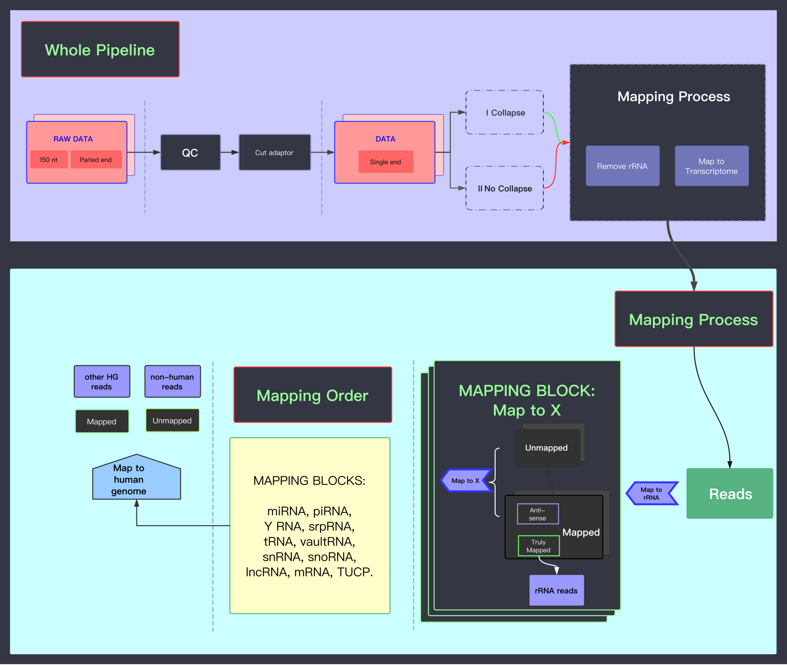

# 1.Mapping, Annotation and QC

## Pipeline



## Data Structure

```text
"shared_scripts"        # shared scripts by Lu Lab
"genomes/hg38"          # reference genomes (i.e. genome sequence and annotation)

github                  # my scripts
proj_exRNA
|-- RNA_index           # rerference transcriptomes (fasta and index) 
|-- sample2_name             
`-- sample1_name        
    |-- fastq           # raw data: fastq files
    |-- fastqc          # QC of fastq
    |-- cutadapt        # trimmed fastq
    `-- mapped          # mapped data: SAM/BAM files
```

### **Inputs**

| **File format** | **Information contained in file** | **File description** | **Notes** |
| --- | --- | --- | --- |
| fastq | **reads** | small RNA-seq reads from single-end libraries. | This will be processed from long reads we got. Raw reads are trimmed as single-ended, 50nt clean reads \(see details in the protocol and example\). |
| fasta | **genome/transcriptome sequences** | sequences of the whole human genome or different RNAs \(transcriptome\) |  |
|  gtf / gff | ** genome annotation** | Default genome annotation file is from GENCODE, mirBase, etc.  | Be careful about exon and intron for mRNA/lncRNA,  precursor and mature product for miRNA. |

### **Outputs**

| **File format** | **Information contained in file** | **File description** | **Notes** |
| --- | --- | --- | --- |
| bam | **alignments, i.e. mapped reads** | Produced by mapping reads to transcriptome | We map to transcriptome for a better sensitivity \(see details in protocol and example\). |
| bigWig | **genomic coordinates** | positions of the mapped reads | reads' file which can be viewed in IGV or UCSC Genome Browser |
| bt2 |  **indexed sequences** | Indexed genome/ transcriptome | Different ncRNA types are indexed separately and mapped sequentially.   |

### Software/Scripts 

* bedtools
* fastqc
* cutadapt
* bowtie2

## Protocol

| **Step** | **Input** | **Tool/script** | **Output** | **Notes** |
| :--- | :--- | :--- | :--- | :--- |
| 0. index transcriptome | hg38.fa \(genome\) + gtf | rsem-prepare-reference | RNA\_index/\*.bt2, ... | We need RSEM to index transcriptome because we'll convert the coordinates in step 1.5 |
| 1.1 fastqc | \*.fastq | fastqc | \*\_fastqc.html | check raw reads' quality |
| 1.2 trim  | \*.fastq | cutadapt | \*.trimmed.fastq | trim low quality ends, keep 50nt, remove 3' adapter |
| 2nd fastqc | \*.trimmed.fastq | fastqc | \*\_fastqc.html | make sure the low quality reads have been removed and/or trimmed |
| 1.3 Remove rRNA | \*.trimmed.fastq + \*.bt2 | bowtie2 | \*.rRNA.bam +  \*.no\_rRNA.fastq | - |
| 1.4. Mapping | \*.no\_rRNA.fastq + \*.bt2 | bowtie2 | \*.miRNA.bam + \*.nomiRNA.fastq --&gt;  \*.piRNA.bam_ _+ \*.no\_piRNA.fastq --&gt; ... --&gt; ... --&gt; | map to different RNAs \(transcriptome\)  step by step |


## Running Scripts

### Example of a single case



```bash
# genome seuqneces and annotaions
ln -s /BioII/lulab_b/shared/genomes ~/genomes
export hg38=~/genomes/human_hg38/sequence/GRCh38.p12.genome.fa
export gtf=~/genomes/human_hg38/gtf

# raw data (fastq files)
cd ~/proj_exRNA/example/fastq
ln -s /BioII/lulab_b/shared/projects/exRNA/hcc_examples/fastq/*.fastq .

# working space
cd ~/proj_exRNA
```



```bash
# Produce indexed transcriptome, using miRNA as an example

#############################################################
# 0: build bowtie2 index using RSEM for RNA transcriptome
#############################################################

rsem-prepare-reference --gtf $gtf/miRNA.gtf --bowtie2 $hg38 RNA_index/miRNA \
  > log.0 2>err.0 &

```



```bash
#############################################################
# 1.1: fastaqc - repeat fastqc before and after each trim step
#############################################################

fastqc -q -o example/fastqc miRNA.fastq \
  > log.1.1 2>err.1.1 &
#output the QC files to a dir examples/fastqc

#############################################################
# 1.2: trim - cut adaptor + trim long read
#############################################################
for i in `ls example/fastq/*.fastq`  ; do
  cutadapt -u -100 -q 30,30 --trim-n -m 15 \  
    -a AGATCGGAAGAGCACACGTCTGAACTCCAGTCAC -o $i.cutadapt  $i  
    # -u -100    remove last 100nt so that the first 50nt is kept
    # -q 30,30   read quality need to be above 30
    # -m 15      reads less than 15nt are removed
done
```



```bash
############################################################# 
# 1.3: map to rRNAs and keep the remaining reads for next 
#############################################################

bowtie2 -p 4 --sensitive-local --no-unal --un NC_1.no_rRNA.fq \
    -x RNA_index/rRNA NC_1.trimmed.fastq -S NC_1.rRNA.sam
     
```



```bash
#############################################################
# 1.4 align cleaned reads to transcriptome (different RNAs) 
#############################################################

# align to miRNA
bowtie2 -p 4 --sensitive-local --no-unal --un NC_1.no_miRNA.fq \
    -x RNA_index/miRNA NC_1.no_rRNA.fastq -S NC_1.miRNA.sam 

```



### [Script of batch job](https://github.com/urluzhi/scripts/blob/master/projects/exRNA/run_example.sh)

## Tips/Utilities

#### Convert gff to gtf

```bash
gffread tRNA.gff -T -o tRNA.gtf
```

#### Lift over gff/bed/bam version

```bash
liftover *.gff ...
liftover *.bed ...
liftover *.bam ...
```

#### Collapse duplicated reads

> Not needed for sRNA-seq.

```bash
#option 1: collapse before mapping
collapse *.fastq 

#option 2: Collapse after mapping
```

## Homework

* Map the example fastq files and using the following criteria to QC the result:

| **Check point** | **Threshold** | **Input** |
| --- | --- | --- | --- | --- | --- |
| Raw reads quality | reads quality &gt;28 \(median lines in green area\) | Check fastqc results\(\*.html\) |
| Clean reads number | &gt; 10 million | cutadapt log file |
| rRNA ratio | &lt; 10% | bowtie2 rRNA mapping log file |
| human genome mapped ratio | &gt; 65% | bowtie2 human genome mapping log file |
| other genome region ratio | &lt; 10% | difference between whole genome and mapped RNA |

* Visualize your mapped reads with _IGV_ \(locally\) and/or _UCSC Genome Browser_ \(on line\).
* Summarize the distribution of reads' length and reads' percentage for each type of RNA.

## More Reading and Practice[ ](https://youngleebbs.gitbooks.io/bioinformatics-training-program/content/exrna-seq-analysis/1preprocessing-mapping-and-qc.html)

* [Additional Tutorial](../getting-startted.md#learning-materials): 1.preprocessing\_mapping\_QC
* [Teaching PPT](../getting-startted.md#learning-materials): 
  * 0. Introduction to exRNA-seq; 
  * 1. Mapping, Annotation and QC
* [Teaching Video](../getting-startted.md#learning-materials):  
  * Week V - PARTII.1.Mapping etc - Wang
  * Week VI - PARTII. 2. run your job - example 1 bash  


